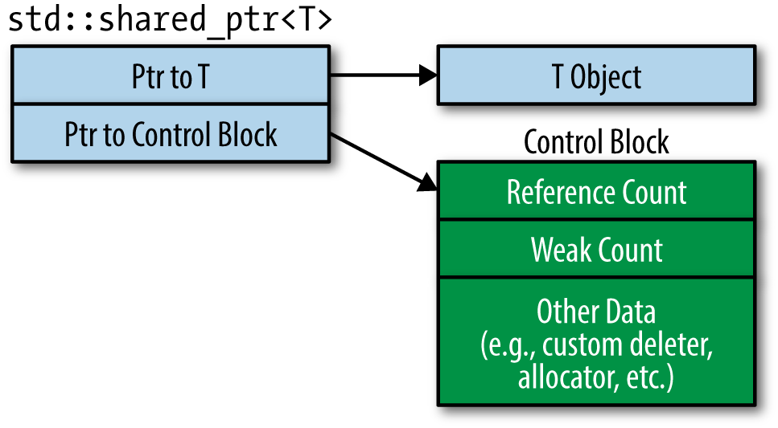

# Learning Notes of < Effective Modern C++ >

> **Required**: [`boost`](https://www.boost.org/) C++ library, and [compiler supports at least `C++14`](https://zh.cppreference.com/w/cpp/compiler_support).
>
> [*items*](42_items.md) 

## 01. [Deducing Types](./source/01_deducing_types.cpp)

### **模板类型推断的基本原则**

```c++
// 伪代码
templte <typename T>
void f(ParamType param);

f(expr)
```

1. 形参类型为普通引用（非通用引用, aka. universal reference/forwarding reference）。

    - 忽略 `expr` 中的引用部分，与 `ParamType param` 匹配，`T` 为剩下的部分

2. 形参类型为通用引用。

    - 若 `expr` 为左值，`T` 与 `ParamType` 都会被推断为左值引用

    - 若 `expr` 为右值，则与 `1.` 同

3. 形参类型既不是指针也不是引用

    - 若 `expr` 是引用，忽略引用部分

    - 忽略 `cv` 限定符

4. **数组形参**

    - 注意退化为指针（`T arr[]` 与 `T *arr` 都会退化）

    - 形参为引用，不会退化（还可以获得实参数组维度）

5. **函数形参**

    - 与数组形参类似

### **`auto` 类型推断**

`auto` 基本相当于模板类型推断中的 `T`。但是要注意从 *初始化列表* 推断的情形。

**NOTE:**

- 模板实参传递 `std::initializer_list<T>` 形参必须显式声明。这点与 `auto` 不同。

- `C++14` 起，`auto` 可以推断函数返回值类型，但是使用的是模板推断规则，所以不能推断 `std::initializer_list<T>`

- `auto` in lambda, ditto

### **`decltype` 类型推断**

- `decltype` 可以获得精确的类型（保留`cv`限定符）

- `decltype(e)` 推断规则

    1. `e` 没有 `()` 括起来，推断结果即其声明类型

    2. `e` 是 `T` 类型的 `xvalue`，推断结果为 `T &&`

    3. `e` 是 `T` 类型的 `lvalue`，推断结果为 `T &`。（同时满足 `1.`，使用 `1.`）

    4. `e` 是 `T` 类型的 `prvalue`，推断结果为 `T`。*（`decltype((a + b))` 为 `T` 不是 `T &`，因为 `a + b` 为纯右值）*

## 02. [`auto`](./source/02_auto.cpp)

### 优先使用 `auto` 而非显式的类型声明

- 可以在编译期避免变量未初始化，否则 `auto` 无法推断类型

- 可以简化冗余的声明（显而易见）

- 可以获得只有编译器知道的类型（闭包）

- avoid `type shortcuts` （类型截断？）--> 不知道确切的类型而想当然的指定。

    1. 典型的如：`int size = vec.size();`，实际为`std::vector<T>::size_type`（通常为 `std::size_t`）。

### 当 `auto` 推断出的类型不是期望类型时，应当使用显式类型初始化的方法

- 翻译的真拗口。其实就是，因为有一些类存在代理类型（如 `vector<bool>`），这会让 `auto` 在表达式初始化时推导出的类型不正确（得到的是代理类型）。这时候应当使用显式类型初始化，使 `auto` 可以正确推导。

## 03. [Moving to Modern C++](./source/03_moving_to_modern_cpp.cpp)

### 注意区分创建对象时的 `()` 和 `{}`

- `{}` 更加通用，并且可以防止隐式的类型截断（implicit narrowing conversion）

- `()` 初始化有可能和函数声明混淆，如 `A a()`，函数声明还是显式调用无参构造函数？`A a{}` 就没有歧义。

- ***drawbacks***: 当定义了接收 `std::initializer_list<T>` 参数的构造函数时，`{}` 初始化会优先匹配该构造函数！即使 `T` 不相同，也会隐式转换。（注意，拷贝或移动构造的情况也有可能）。一个很重要的例子就是 `std::vector<IntType>` 通过两个参数构造时，可变参数模板内使用时要格外小心。

### 使用 `nullptr`，废弃 `0` 和 `NULL`

- 这是一个毫无悬念的选择。`0` 和 `NULL` 本质上是整型类型，某些情况下会有歧义影响重载决议。并且模板推导只会从它们推导出整型类型，而非指针类型。

### 优先使用类型别名，尽量避免`typedef`

- 直观的，类型别名定义比使用 `typedef` 更加清晰

```C++
// function ptr
typedef void(*FP)(int, const std::string &);
using FP = void(*)(int, const std::string &);
```

- 类型别名可以模板化（别名模板 alias templates），`typedef` 不可以

```C++
template <typename T>
using MyAllocList = std::list<T, MyAlloc<T>>;

MyAllocList<MyType> lst;

template <typename T>
struct MyAllocList {
    typedef std::list<T, MyAlloc<T>> type;
};

MyAllocList<MyType>::type lst
```

- 用在模板内部时，`typedef` 因为有 `::type` 是个依赖类型（待决名，因为模板不知道它代表的是类型）需要加 `typename` 前缀

```C++
template <typename T>
class Widget {
private:
    typename MyAllocList<T>::type list; // when using `typedef`
    MyAllocList<T> list;                // when using `using`
};

// this can be seen in type_traits
// eg.
// std::remove_const<T>::type;  // since C++11
// std::remove_const_t<T>;      // since C++14
```

### 尽量使用作用域枚举类型

- 作用域枚举类型的枚举项只对枚举内可见，只能通过 `cast` 转为其他类型

- 作用域和无作用域枚举类型都可以指定底层数据类型，作用域枚举类型默认是 `int`，无作用域枚举类型没有（由编译器决定） --> 因此作用域枚举类型可以前置声明，无作用域枚举类型只有指定底层类型的情况下可以前置声明。

### 使用 `delete` 来弃置函数，不要使用 `private`

- `delete` 适用于所有函数，不仅仅是成员函数（trick: 过滤模板）

- `member function ref-qualifier`

### 虚函数覆盖请在声明末尾加上 `override`

- `override` 可以告诉编译期这是一个派生类覆盖函数，请检查和基类函数签名是否一致（如果没有，可能出现函数隐藏的情况）

### 优先使用 `const_iterator` 而不是 `iterator`

- `cbegin()`，`cend()`

- 在通用代码中，使用非成员函数版本的 `begin, end, rbegin, etc.`

### 如果确定函数不会抛出异常，请在声明时加上 `noexcept`

- `noexcept` 是函数接口的一部分

### 在任何能用 `constepxr` 的地方使用 `constepxr`

- `constepxr` **变量** 必须在编译期求得

- `constepxr` **函数** 如果传入参数是编译期可求得，函数的返回结果也必须可以在编译期求得；如果传入参数是运行时才能知道，函数就和普通函数一样

    1. `C++11` 的 `constepxr` 函数只允许包含一条可执行语句（有且只有一条 `return` 语句），`C++14`放宽了这一限制

    2. `constepxr` 只能返回 `literal` 类型，基本类型满足这个要求，自定义类型要求构造函数也是 `constepxr` 的（成员也要有 `constepxr` 构造函数）

    3. `constexpr` 构造函数又要求其每个参数都是 `literal` 类型

    4. `constexpr` 是函数接口的一部分

- [more details](https://zh.cppreference.com/w/cpp/language/constexpr)

### 确保 `const` 成员函数线程安全

- 确保 `const` 成员函数是线程安全的，除非它不会在多线程中使用

- 可以使用 `std::mutex`，重量级；也可以使用 `std::atomic`，轻量级但如果函数中有多个变量需要原子操作，还是使用 `std::mutex` 来保证线程安全吧

### 理解特殊的成员函数

- 默认构造函数，默认析构函数，拷贝构造函数，拷贝赋值运算符，移动构造函数，移动赋值运算符

```C++
class Widget {
public:
    Widget();
    virtual ~Widget() noexcept;
    Widget(const Widget &w);
    Widget &operator=(const Widget &w);
    Widget(Widget &&w);
    Widget &operator=(Widget &&w);
};
```

- **Rule of Three for `C++98`**: 如果自定义了*拷贝构造*，*拷贝赋值*，*析构*中的一个，其余几个也得手动定义（删除也可以）。否则编译器会自动生成默认的（复杂的类，有可能出问题）

- 默认移动操作只有在需要时才生成，但还有以下前提：

    1. 没有定义拷贝操作

    2. 没有定义移动操作

    3. 没有定义析构操作

- `C++11` rules:

    1. **默认构造**：同 `C++98`，仅当类没有用户自定义沟站函数时才会生成

    2. **默认析构函数**：基本与 `C++98` 相同，只有基类析构为虚，生成的析构才是虚；有一点不同的是 `C++11` 默认生成的析构是 `noexcept` 的

    3. **默认拷贝构造**：行为同 `C++98`，拷贝非静态成员；生成规则不同，仅当无用户自定义拷贝构造时才生成，如果有用户定义的移动操作则不会生成，`98`中当用户自定义了拷贝赋值或者析构时生成默认拷贝构造的规则被废弃了

    4. **默认拷贝赋值**：与**默认拷贝构造**规则类似

    5. **默认移动构造**和**默认移动赋值**：移动非静态成员，仅当类没有用户定义的拷贝操作、移动操作、和析构时才会生成。

- ***NOTE***: 特殊成员函数模板不会阻止生成这些特殊的成员函数

## 04. [Smart Pointers](./source/04_smart_pointers.cpp)

### 对于独占所有权的资源，使用 `std::unique_ptr`

- `std::unique_ptr` 很轻巧（和裸指针一样），很快，是一个不可移动的独占资源所有权的智能指针。

- 默认情况下，`std::unique_ptr` 使用 `delete` 释放资源，但是可以自定义 `deleter`（注意 `lambda expression` 和 `function pointer/std::function"` 对 `std::unique_ptr` 对象大小的影响）

- `std::unique_ptr` 可以转换为 `std::shared_ptr`

### 对于共享所有权的资源，使用 `std::shared_ptr`

<!---->

<p align="center">

</p>

- `std::shared_ptr` 可以对共享资源所以权的指针进行管理（通过引用计数），它通常比 `std::unique_ptr` 大两被，因为它还有一个指针指向额外的控制块。这个控制块包含了原类型的引用计数，删除器和弱引用计数等（所以它的自定义删除器与 `std::shared_ptr` 类型无关）

- 不要从裸体指针创建 `shared_ptr`，因为你没法知道是否已经有 `shared_ptr` 在管理这个指针，拿不到它的控制块，最后各自维护引用计数，有可能多次释放同一块地址

- `std::enable_shared_from_this`

### 对于可悬垂指针，使用 `std::weak_ptr`

- `weak_ptr` 用起来和 `shared_ptr` 类似，但是它不影响实际对象的引用计数，并且不能被直接解引用（不会控制/影响对象的生命周期，但可以知道对象是否还活着，所以成为悬垂指针是安全的）

- 潜在的使用场景：对象缓存、观察者模式、打破 `std::shared_ptr` 的循环引用

### 优先使用 `std::make_unique` 和 `std::make_shared` 来创建智能指针，而不是通过 `new`

- 与直接使用 `new` 相比，`make` 系函数可以避免重复代码，保证异常安全，并且生成更小更快的代码（`new` 的方法有额外的内存分配）

```C++
int computePriority();
void processWidget(std::shared_ptr<Widget> spw, int priority);

// unsafe
// 1. new Wigett
// 2. computePriority --> raise exception
// 3. shared_ptr constructor won't be called. raw pointer becomes dangle
processWidget(std::shared_ptr<Widget>(new Widget), computePriority());

// safe 1
processWidget(std::make_shared<Widget>(), computePriority());

// safe 2
auto spw = std::shared_ptr<Widget>(new Widget);
processWidget(std::move(spw), computePriority());
```

- 但是如果要指定自定义删除器的话，`make` 系函数是没法做到的。另外通过 `{}` 构造对 `make` 系函数也是一个坑（与 `std::initializer_list` 混淆，参见 `auto`）

- 对于 `shared_ptr`，还有额外的两种情况不适合使用 `make` 系函数。

    1. 具有自定义内存管理的类（`operator new`，`operator delete`）

    2. 系统对内存敏感的情况，对于大对象，使用 `make` 系函数的话对象的生命周期会延长

### 使用 `pimpl` 时，特殊的成员函数要在实现文件中定义

- `pimpl` 可以减少类的使用者对类定义的依赖，从而节省编译时间

- 在 `pimpl` 使用 `std::unique_ptr` 时，类的特殊成员函数声明要放在头文件中，实现放要在实现文件中的，以避免头文件中包含了 `std::unique_ptr` 析构相关的函数，导致编译错误。（即使类的默认特殊函数功能上可行，我们也必须这么做）

- 上一点，如果用 `std::shared_ptr` 的话就不需要了，完全没烦恼

## 05. [Rvalue References, Move Semantics, and Perfect Forwarding](./source/05_rvalue_ref_move_and_perfect_forwarding.cpp)

> 参数永远是左值，即使它被声明为右值得形式如 `void f(Widget &&w);`

### 理解 `std::move` 与 `std::forward`

- `std::move` 和 `std::forward` 其实什么都没做！他们只是 `cast` 了一下。

- `std::move` 无条件地将对象转为 `rvalue`，`rvalue` 就**可能**被移动了。**可能**！仅仅是**可能**！会不会被移动还要看具体情况

- `std::forward`，左值转左值，右值转右值。依赖于 `T`

### 所谓的“通用引用”与右值引用的区别（形式上都是 `T&&`）

> **通用引用**其实是一个语义上的抽象概念，本质是引用折叠

- 右值引用表示它只能接受右值

- 所谓的通用引用既可以接受右值，也可以接受左值，也无所谓 `const` 与否（可以接受一切），但是接收过来的值变成什么要看情况（类型推断/引用折叠）。所谓的通用引用主要出现在以下两种情形中

    1. 函数模板 `template <typename T> void f(T &&param);`

    2. `auto` 声明 `auto &&var2 = var1;`

- 通用引用必须是在需要类型推断的 `T&&` 情形，以下情况就不符合

```C++
// case 1
template <typename T>
void f(std::vector<T> &&param); // param 是右值引用，它的声明不是 T&&

// case 2
template <typename T>
void f(const T &&param); // param 是右值引用

// case 3
template <typename T>
class vector {
public:
    ...
    // 是右值引用，因为这里不存在类型推断，调用该函数时类型早就确定了
    void push_back(T &&v);
    // 是通用引用
    template <typename... Args>
    void emplace_back(Args&&... v);
    ...
};
```

### 对右值引用使用 `std::move`，对通用引用使用 `std::forward`

- 对右值引用使用 `std::move`，对通用引用使用 `std::forward`

- 如果传入的对象不是右值，也使用 `std::move`，会将它转为右值，有可能被 `move`（不再拥有资源）

- 如果函数返回值类型，并且返回的对象绑定到右值引用或者通用引用，请使用 `return std::move(obj);`（这样可以避免不必要的拷贝）

- 但是！如果函数返回值类型，但返回对象是一个局部对象！请不要使用 `return std::move(obj);`（虽然看上去它会避免拷贝，但实际上，这种情况编译器会做优化`RVO`，编译器的优化更好）

### 避免对通用引用重载

- 通用引用有更加精确的匹配，如果重载版本需要类型提升之类的才能匹配的话，显然匹配到通用引用上去了

- `std::forward` 通用引用的构造函数是很危险的！因为它会比拷贝构造函数有更精确的匹配（他可以生成不带 `const` 的左值引用形参版本），而且它会劫持派生类对基类的默认拷贝/移动构造函数的调用

### 重载通用引用的替代方法

- 放弃重载，定义不同的函数来处理。但是，构造函数就没办法了，你没法给它改名

- 放弃通用引用，使用 `const T &`（它也可以绑定到右值），不过效率不高

- 放弃通用引用，使用值传递，然后内部使用 `std::move`，如果参数是不能移动，拷贝也无法避免

- 添加额外的参数来区分选择哪个重载版本（tag dispatch）

- 对通用引用的模板进行约束（所以需要`concept` from `C++20`，`SFINAE`/`type traits`/`std::enable_if` for now）

### 引用折叠

- `& &&` == `&& &` --> `&` (1)

- otherwise, `&&` (2)

| 形参  |  实参  |实例化形参|comment|
|:-----:|:-----:|:-------:|:-----:|
| `T&`  | `A&`  |  `A&`   |  (1)  |
| `T&`  | `A&&` |  `A&`   |  (1)  |
| `T&&` | `A&`  |  `A&`   |  (1)  |
| `T&&` | `A&&` |  `A&&`  |  (2)  |

- 发生引用折叠的情况：1. 模板推断（`T&&`），2. `auto` 推断（`auto&&`），3. `typedef` 或类型别名（`typedef T&& MyType;`），4. `decltype`

### 有的时候并没有移动操作，或者移动反而更低效，或者无法移动

- **没有移动操作**：待移动对象没有提供移动操作，移动就变成了拷贝

- **移动反而低效**：待移动对象支持移动操作，但是移动反而比拷贝低效（`std::string` SSO）

- **移动操作不可用**：某些上下文中，需要移动操作不抛出异常，但移动操作并没有被声明为 `noexcept`

- **源对象是左值**：除个别例外，只有右值才可以移动

### 完美转发会失败的情况

```C++
void f(ParamType param);

template <typename ...Ts>
void fwd(Ts ...params) {
    f(std::forward<Ts>(params)...);
}

// 传入同样参数
f(expression);      // 如果 f 做了某件事
fwd(expression);    // fwd 做了另一件事，就叫完美转发失败
```

- 失败原因主要有：

    1. 编译器无法推断出类型

    2. 编译器推断出“错误”的类型（没有匹配）

- 失败的情形主要有：

    1. `{}` 初始化

        ```C++
        void f(const std::vector<int> &v);

        f({1, 2, 3});       // OK, {1, 2, 3} is implicitly converted to std::vector<int>
        fwd({1, 2, 3});     // error! can't compile => 无法推断类型
        ```

    2. 使用 `0` 或者 `NULL` 做空指针（无法正确推断类型）

    3. `static const` 或者 `constepxr` 成员变量只声明未定义（无法链接）

    4. 传递重载函数名或模板名作为参数（模板不知道从哪个函数来推断类型）

    5. 位域（模板参数是非 `const` 引用，[而指向位域的指针和非 `const` 引用是不允许的](https://zh.cppreference.com/w/cpp/language/bit_field)）

## 06. [Lambda Expressions](./source/06_lambda_expressions.cpp)

### 尽量不要使用默认的捕获方式

- 所谓的默认捕获方式就是如 `[=]` 和 `[&]` 的值和引用捕获

- 默认引用有可能发生超出作用域后捕获的对象被释放，导致悬垂

- 默认的值捕获有可能发生悬垂指针（尤其是类中的 `this` 会被默认捕获）

- 比较好的方法是指定捕获对象，使用值拷贝

### 使用初始化捕获将对象移动到闭包内

- `[data = std::move(data)]() { //... }` C++14 (C++11 不支持)

- C++11 workaround

    1. 自定义一个类（超级麻烦）

    2. `std::bind`

        ```C++
        auto func = std::bind(
            [](const T &data) { //xxx },
            std::move(data)
        );
        ```

### 对 `auto&&` 使用 `decltype` 来进行完美转发

```C++
// 闭包类的 `operator()` 是一个模板
auto f = [](auto x) { return normalize(x); };

// 类似于
class SomeCompilerGeneratedClassName {
public:
    template <typename T>
    auto operator()(T x) const {
        return normalize(x);
    }
    //...
};
```

```C++
auto f = [auto &&... params] {
    return func(normalize(std::forward<decltype(params)>(params)...));
};
```

### 使用 lambda 表达式，不要再使用 `std::bind`

- `std::bind` 晦涩，`lambda` 精简且在某些情况下效率更高

- 只有在C++11想实现移动捕获时，可能不得不用 `std::bin`
